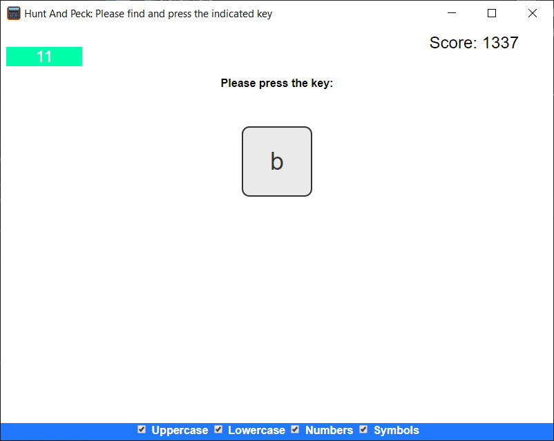

# HuntAndPeck

Hunt And Peck is a game that I wrote to help my son learn the placement of the keys on the keyboard and its designed to enhance your ability to find and remember where computer keyboard keys are.  Are you ready to put your hunt and peck abilities to the test?

The game utilizes PyQt and a "web-view" to load an offline HTML, CSS, and JavaScript game/application.

Objective:
The objective of the game is simple: you will be prompted to press a selected key on your keyboard within a time limit. Your task is to accurately press the correct key before the timer reaches zero.

As soon as the game starts, a timer bar will appear on the screen, displaying the remaining time in seconds. The initial value of the timer will be set to 15. You must press the correct key before the timer ticks down to zero.

There are options to include different key types such as uppercase, lowercase, numbers, and symbols. By selecting more key types, you can increase the difficulty of the game. However, you can disable the key types that you don't want. If no options are selected, the game will default to using lowercase letters.

## Key Types:
* **Uppercase Letter Keys:** ABCDEFGHIJKLMNOPQRSTUVWXYZ
* Lowercase Letter Keys: abcdefghijklmnopqrstuvwxyz
* Number Keys: 0123456789
* Symbol Keys: ~!@#$%^&*()_+{}|:<>?`-=[];',./

### How the game works:

1. A random key from the selected key types will be displayed on the screen as the target key that you need to press.
2. As soon as the target key is displayed, the timer will start ticking down from 15 seconds.
3. Your task is to locate and press the target key on your keyboard within the given time frame.
4. If you press the correct key before the timer reaches zero, you will be awarded the remaining time as a score. For example, if you press the correct key when there are 5 seconds left on the timer, you will earn 5 points.
5. If you fail to press the correct key within the given time, or if the timer reaches zero, the round will end, and a new target key will be selected.
6. The game continues with a new target key and a reset timer. Your overall score will accumulate as you successfully press the correct keys.

The game will test your ability to find and remember the placement of keys on a keyboard, and it rewards speed and accuracy. Challenge yourself to achieve a high score by pressing the correct keys with precision and efficiency.

Let's get hunting and pecking!

### How to Run the Game:

Run the file: [HuntAndPeck.pyw](HuntAndPeck.pyw)

### Requiremets:
[Python](https://www.python.org/downloads/)

[PyQt5](https://pypi.org/project/PyQt5/) - __pip install PyQt5__

### Licence:
[MIT LICENCE](LICENSE)
